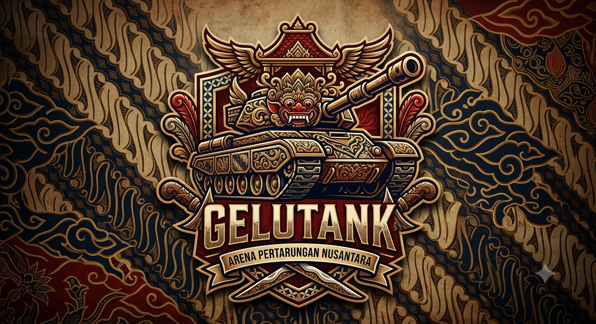

# 🛡️ Gelutank



**Tank Battle Seru buat Keluarga**

Gelutank dibuat dengan satu tujuan sederhana: jadi alasan buat keluarga ngumpul, ketawa bareng, dan main bareng — bukan cuma masing-masing pegang HP sendiri-sendiri. Nggak perlu koneksi ribet atau download berat, cukup buka link-nya, pilih bentuk & warna tank kesayangan, dan langsung gaspol tembak-tembakan seru di satu map yang sama.

Fitur tim berbasis warna sengaja dibikin biar keluarga bisa main bareng satu tim — ayah-ibu-anak pilih warna yang sama, jadi nggak bakal saling "tembak" sendiri, malah saling bantu lawan bot-bot musuh atau tim keluarga lain. Cocok buat ngisi waktu santai sore hari, reunian keluarga, atau sekadar hiburan ringan tanpa harus mikir strategi ribet — yang penting seru dan ketawa bareng.

*Dibuat dengan penuh keceriaan oleh **DHAMAS**, untuk keluarga tercinta.*

---

## 🎮 Cara Main

1. Buka link game di browser (HP atau laptop, tidak perlu install apa-apa).
2. Di lobby, isi nickname, pilih bentuk tank (circle / square / triangle), dan pilih warna.
3. **Warna = tim** — pemain lain yang pilih warna sama otomatis jadi rekan satu tim (tidak bisa saling menyerang, malah saling bantu).
4. Tekan **BERPERANG!** dan langsung main.
5. Kalahkan bot musuh (segitiga merah) atau pemain lawan untuk naik skor dan menambah HP. Bot netral (kotak kuning) bisa ditangkap jadi ally/shield yang ikut membantu menyerang.

## 🛠️ Menjalankan Secara Lokal

Butuh Python 3, tidak ada dependency tambahan (murni pakai library bawaan Python).

```bash
python app.py
```

Server akan jalan di `http://localhost:5000` (atau port dari environment variable `PORT` kalau di-set).

Struktur folder yang wajib:

```
gelutank/
├── app.py
└── templates/
    └── index.html
```

## ☁️ Deploy Online (Render)

1. Push repo ini ke GitHub.
2. Buat akun di [render.com](https://render.com) (bisa langsung connect ke GitHub, tanpa kartu kredit).
3. **New +** → **Web Service** → pilih repo ini.
4. Konfigurasi:
   - **Runtime**: Python 3
   - **Build Command**: (kosongkan)
   - **Start Command**: `python app.py`
   - **Instance Type**: Free
5. Tambahkan environment variable `RESET_KEY` dengan nilai rahasia sendiri (jangan pakai default).
6. Deploy, tunggu status **Live**, lalu bagikan URL-nya ke keluarga/teman.

> Catatan: di free tier, server akan "tidur" setelah idle beberapa menit dan butuh waktu untuk bangun lagi saat diakses ulang — state permainan (skor, posisi) akan reset setiap server restart.

---

Selamat berperang seru bareng keluarga! 🚀
